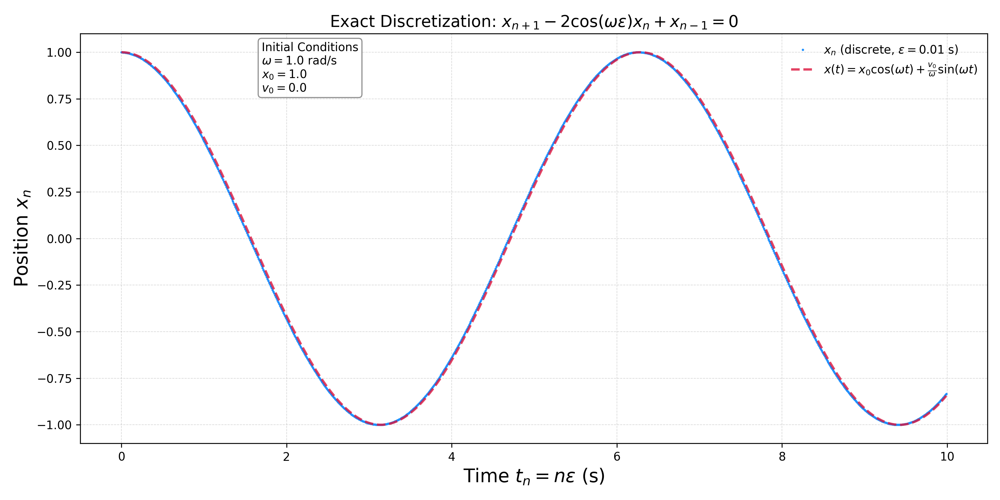

# Exact Discretization Papers

This folder contains the two foundational papers used in this project to generate exact discrete time series for the harmonic oscillator.

## Papers

1. **[Cieśliński & Ratkiewicz (2005)]**  
   *On simulations of the classical harmonic oscillator equation by difference equations*  
   [arXiv:physics/0507182](https://arxiv.org/abs/physics/0507182)

2. **[Cieśliński (2009)]**  
   *On the exact discretization of the classical harmonic oscillator equation*  
   [arXiv:0911.3672](https://arxiv.org/abs/0911.3672)

##  Purpose

These papers provide:
- Symplectic and time-reversible discrete analogs of the harmonic oscillator
- Exact formulas for damped and driven oscillators
- A clean benchmark for testing entropy learning in the SKA framework

They are used here to generate the real-time input stream $\large x_n$ for the SKA learner.

## Files Included

- **`harmonic_oscillator.py`**  
  Python script that generates real-time harmonic oscillator data using exact discretization. It produces both:
  - a time series plot (`harmonic_oscillator.png`)
  - a structured JSON output file for downstream SKA processing

- **`harmonic_oscillator.png`**  
  Visualization comparing the exact discrete trajectory $\large x_n$ with the continuous analytical solution $\large x(t)$.

- **`ska_harmonic_data_*.json`**  
  Automatically generated JSON file containing timestamped $\large x_n$ values for SKA input.


## Usage

Run the script to generate data:

```bash
python harmonic_oscillator.py
```

This will:

Print and stream $\large x_n$ values to the console

Save a .json file with metadata and data

Save a .png figure for visual inspection

# Example plot

