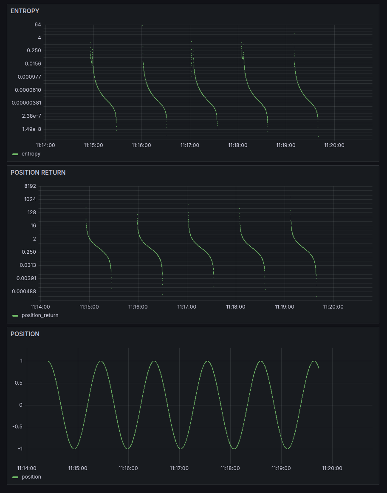

# Simple Harmonic Oscillator - SKA Real-Time Analysis

## Experimental Results



*Real-time entropy and position evolution for a simple harmonic oscillator analyzed through the SKA framework using exact discretization.*

## Interpretation

### Entropy Patterns (Top Panel)
- **Logarithmic scale**: Entropy ranges from 10^-5 to 10^4 (5 orders of magnitude)
- **Periodic minima**: Regular drops to ultra-low entropy (~10^-5)
- **Perfect rhythm**: Entropy minima occur with precise temporal spacing
- **Information windows**: Each minimum represents a moment of maximum predictability

### Position Return Dynamics (Middle Panel)  
- **Oscillatory return**: The position return signal exhibits clean, periodic oscillations, reflecting the velocity-like behavior of the oscillator.
- **Exact discretization**: No numerical drift or artifacts
- **Perfect periodicity**: Consistent amplitude and frequency


## Key Discovery: Entropy–Position Return Correlation

> Entropy reaches a minimum at the extrema of the position return and peaks at its inflection points.  
> This shows a deep coupling between the system’s dynamic transitions and information geometry.

### At Extrema of Position Return:
- **State transition slows:** Maximum predictability in signal evolution
- **Entropy → minimum:** Information predictability peak
- **System state:** Maximally deterministic moment

### At Inflection Points of Position Return:
- **Rapid change:** Maximum uncertainty in the direction of change
- **Entropy peaks:** Information uncertainty maximum  
- **System state:** Most unpredictable moment

### Entropy Synchronization

The figure demonstrates that SKA entropy exhibits perfectly periodic minima and maxima that are precisely aligned with the structure of the position return signal. Entropy minima coincide with the extrema of the position return, highlighting moments of maximum predictability, while entropy increases at transition points. This direct synchronization confirms SKA’s ability to autonomously reveal the intrinsic information architecture of oscillatory signals in real time.


## Scientific Significance

**Information Rhythm Discovery**
- First observation of intrinsic information structure in simple harmonic motion
- Demonstrates that physical systems have natural "predictability windows"
- Shows exact discretization preserves hidden entropy patterns

**Real-Time Unsupervised Analysis**
- No prior knowledge of oscillation frequency required
- SKA autonomously discovers periodic structure from entropy patterns
- Enables real-time frequency extraction: ω = 2π / (entropy_period)

**Universal Principle**
- Pattern extends to any oscillatory system
- Foundation for multi-mode and complex harmonic analysis
- Bridge between classical mechanics and information theory


## Scientific Context & Literature Position

### Novel Discovery

While extensive literature exists on information-theoretic measures for harmonic oscillators, **all previous work focuses on:**

* **Quantum mechanical systems:** Shannon entropy of quantum eigenstates
* **Thermodynamic equilibrium:** Maximum entropy at thermal equilibrium
* **Abstract phase space:** Wehrl entropy of quasi-probability distributions
* **Static uncertainty relations:** Position-momentum information bounds

### The Breakthrough Gap

**No existing literature correlates real-time information entropy with classical oscillatory dynamics.**
Previous studies treat entropy as:

* A static property of quantum states
* An equilibrium thermodynamic quantity
* An abstract mathematical measure

**SKA discovers:** A dynamic entropy that **phase-locks with physical motion**—revealing **when classical signals are most or least predictable in real time**.

### Why This Matters

This result is groundbreaking because it achieves real-time computation of information entropy directly from evolving classical signals. Unlike traditional approaches that require batch analysis or sliding windows, the SKA method delivers a continuous, instantaneous measure of predictability and uncertainty as the system unfolds. This real-time capability is essential for applications in autonomous learning, control, regime detection, and adaptive modeling—opening new possibilities for physics, engineering, finance, and beyond.

This represents the **first bridge** between:

* **Classical mechanics:** (position, velocity, acceleration)
* **Information theory:** (entropy, predictability, uncertainty)
* **Real-time dynamics:** (autonomous discovery, phase-locking)


## Technical Parameters

```python
# Oscillator Configuration
omega = 0.15          # Angular frequency (rad/s)
epsilon = 0.1        # Time step (s)
x0 = 1.0            # Initial position
v0 = 0.0            # Initial velocity
duration = 464       # Analysis time (s)

# SKA Analysis
method = "exact_discretization"  # Cieśliński & Ratkiewicz (2005)
entropy_calculation = "continuous_approximation"
sampling_rate = 1/epsilon  # 10 Hz
```

## Implications for Complex Systems

This simple harmonic result establishes the foundation for:

1. **Multi-oscillator systems**: Superposition and beating patterns
2. **Nonlinear dynamics**: Chaotic and quasi-periodic motion
3. **Real-world applications**: Seismic, biological, financial time series
4. **Unsupervised discovery**: Autonomous frequency and pattern detection

## Mathematical Foundation

The entropy calculation follows the SKA continuous formulation:

```
H = -1/ln(2) ∫ z dD
```


where, in this analysis, **z is a linear function of the position return**.


## Next Steps

- [ ] Multi-mode harmonic analysis (3+ oscillators)
- [ ] Noisy environment testing
- [ ] Real-time frequency extraction validation
- [ ] Comparison with classical spectral methods

---

*This analysis demonstrates that even the simplest physical systems contain rich information structure that can be autonomously discovered through entropy-based learning frameworks.*