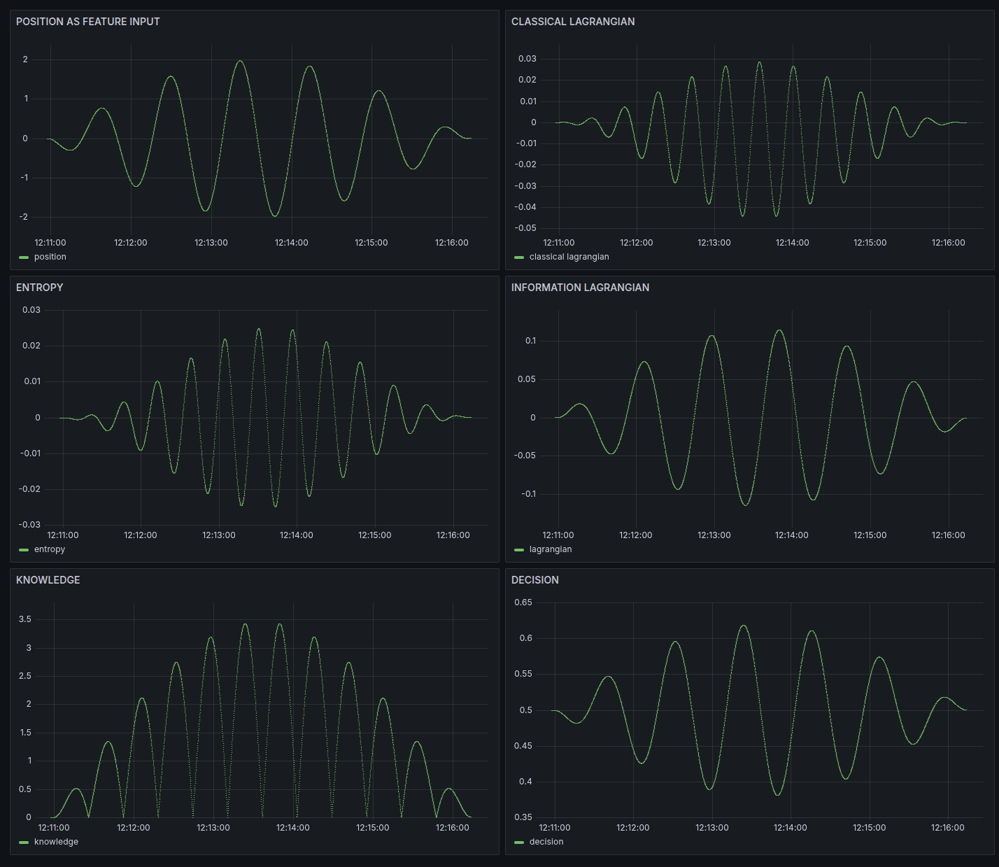

# Simple Harmonic Oscillator - SKA Real-Time Analysis

## Experimental Results



*Real-time analysis of a simple harmonic oscillator using the SKA framework, with **position as the only feature input**. The dashboard shows the evolution of position, classical and information Lagrangians, entropy, knowledge, and decision variables over time.*

## Interpretation

### Position as Feature Input (Top-Left Panel)

* The **raw position** of the oscillator is directly used as the feature for SKA learning.
* Exhibits perfect periodicity and amplitude, reflecting the oscillator's deterministic motion.

### Classical and Information Lagrangian (Top-Right, Middle-Right)

* **Classical Lagrangian:** Shows the difference between kinetic and potential energies, evolving periodically.
* **Information Lagrangian:** Tracks the SKA-driven information change, synchronized with the oscillator's dynamics.

### Entropy (Middle-Left)

* SKA entropy varies periodically in **perfect sync with the oscillator's position.**
* **Minima** in entropy correspond to the points of maximum predictability in the position trajectory (peaks and troughs).
* **Maxima** in entropy align with rapid transitions (zero crossings), where uncertainty in the system is greatest.

### Knowledge (Bottom-Left)

* The SKA "knowledge" variable accumulates in phase with the oscillator, highlighting predictable windows.
* Knowledge increases during periods of high predictability and plateaus when uncertainty rises.

### Decision (Bottom-Right)

* The decision variable oscillates smoothly, directly reflecting the learned probability of the current state.
* Peaks and valleys in the decision variable phase-lock with position extrema.


## Key Discovery: Entropy–Position Synchronization

> **Entropy reaches its minimum at the extrema of the position trajectory and peaks at the zero-crossings.**
> This reveals a **direct, phase-locked relationship between the information geometry and physical motion**—the SKA framework autonomously identifies windows of predictability and uncertainty in real time.

#### At Position Extrema:

* **Maximum predictability** (entropy minima)
* **Knowledge accumulation** is steepest
* **Decision variable** is most confident

#### At Position Zero-Crossings:

* **Maximum uncertainty** (entropy maxima)
* **Knowledge plateaus** as system transitions
* **Decision variable** shows least confidence

This direct synchronization **confirms SKA’s ability to autonomously reveal the intrinsic information structure of physical signals** in real time, using only the position as feature input.


## Scientific Significance

**Intrinsic Information Rhythm**

* First observation of real-time, phase-locked entropy patterns in classical harmonic motion using only position data.
* Reveals natural "predictability windows" that are invisible to classical, equation-based analysis.

**Autonomous, Real-Time Learning**

* SKA requires **no prior knowledge** of system frequency or phase.
* Automatically extracts periodic structure and predictability windows from raw position data.

**Universal Principle**

* Principle extends to any oscillatory or recurrent system.
* Lays groundwork for complex, multi-oscillator, or nonlinear systems.

**Bridges Physics and Information Theory**

* Connects mechanical variables (position) with information-theoretic measures (entropy, knowledge, decision).
* Demonstrates that **information structure is a hidden property, revealed only through learning.**


## Literature Context & Novelty

While information measures are widely used in quantum systems, equilibrium thermodynamics, and phase space analysis, **no previous literature links real-time entropy computation to classical position dynamics** in harmonic motion. SKA establishes the first bridge between:

* **Classical mechanics** (position as observable)
* **Information theory** (real-time entropy and knowledge)
* **Autonomous learning** (unsupervised discovery of hidden structure)


## **Insight: Information Structure is Revealed by Learning**

> **The true information architecture of a physical system emerges only through the process of structured knowledge accumulation (SKA).**
> While classical mechanics provides the trajectory, only SKA learning illuminates when the system is most predictable or uncertain, uncovering the system’s hidden informational geometry.


## Technical Parameters

```python
# Oscillator Configuration
omega = 0.15           # Angular frequency (rad/s)
epsilon = 0.1          # Time step (s)
x0 = 1.0               # Initial position
v0 = 0.0               # Initial velocity
duration = 464         # Analysis time (s)

# SKA Analysis
feature = "position"                # Only position is used as the feature input
method = "exact_discretization"     # Cieśliński & Ratkiewicz (2005)
entropy_calculation = "continuous_approximation"
sampling_rate = 1/epsilon           # 10 Hz
```


## Implications for Complex Systems

This result establishes a foundation for:

1. **Multi-oscillator analysis:** Detecting superposition and beating from position signals alone.
2. **Nonlinear and chaotic systems:** Tracking information flow in complex dynamics.
3. **Real-world data:** Applying SKA to seismic, biological, or financial position-like signals.
4. **Unsupervised feature discovery:** Real-time detection of regimes and transitions.


## Mathematical Foundation

The SKA entropy is computed as:

$$
H = -\frac{1}{\ln 2} \int z \, dD
$$

where **z is a function of position only** in this setup.


## Next Steps

* [ ] Multi-oscillator (superposition) analysis
* [ ] Robustness to noise and missing data
* [ ] Real-time frequency extraction
* [ ] Benchmark against classical spectral analysis


*This analysis demonstrates that even the simplest physical systems encode rich, hidden information structure—discoverable in real time through entropy-based learning using only position as the input feature.*


